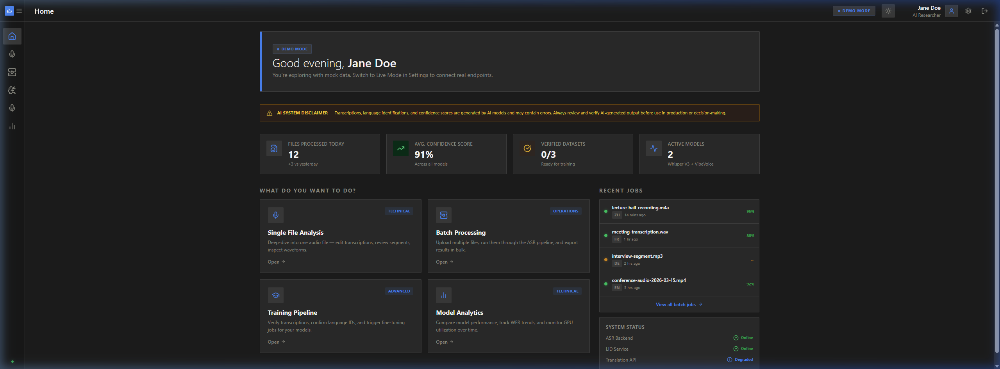
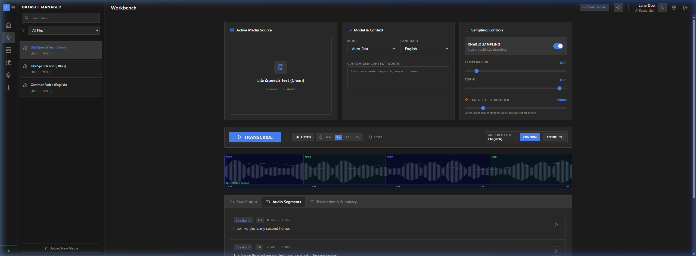
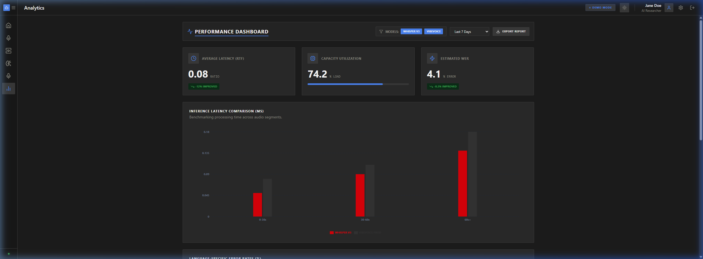

# ASR Model Evaluation Platform

A premium, full-stack workbench for evaluating Global Speech Recognition (ASR) models. This platform provides an institutional-grade environment for researchers to validate model performance, latency, and accuracy across diverse datasets.



## Core Capabilities

- **Single File Analysis**: Deep-dive into audio transcriptions with timestamp-level accuracy and sentiment visualization.
- **Model Analytics**: Real-time telemetry for latency (RTF), capacity utilization, and Word Error Rate (WER) tracking.
- **Batch Processing**: Scalable orchestration for multi-file ASR pipelines and dataset management.
- **Institutional Design**: A professional interface built with a 2px geometry and premium dark-mode aesthetics.

<div align="center">
  
  
</div>

## Tech Stack

- **Frontend**: React 18, Vite, TypeScript, Tailwind CSS, Shadcn/UI.
- **Backend**: FastAPI (Python 3.12+), Pydantic.
- **Design**: 2px Geometry, Obsidian-inspired color palette.

## Getting Started

### 1. Backend
```bash
cd backend
uvicorn main:app --reload
```

### 2. Frontend
```bash
cd frontend
npm run dev
```

The application will be available at: `http://localhost:5173`

---
*Built for High-Performance Speech Recognition Evaluation.*
